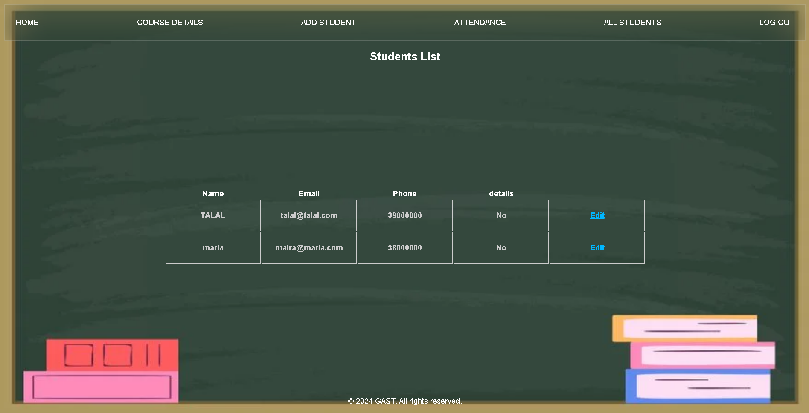
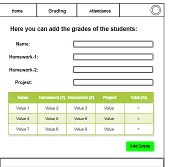
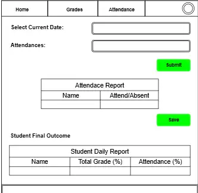
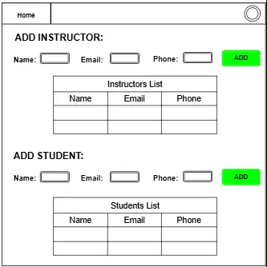

# **_GAST_**

## Date: \*_22/5/2024_

### \*_By Talal Abdulla_

### \*_By Maria Alawadhi_

### \*_By Mohammed Hussain_

---

### **_description_**

#### GAST stands for (General Assembly Students Tracker) which is admin/user application where the admin and instructors can track the grades and the attendace of the students , the main reason behind it is to help the instructors more to track the requirements of the students.

---

### **_Technologies Used_**

- Javascript
- EJS
- MongoDB
- Mongoose
- Express
- Google OAuth
- CSS

---

### **_Screenshots_**

## 

## 

## 

## 

---

### **_Future Updats_**

- [ ] The student can use it also to track their attendance and grades
- [ ] The student can upload his excused absences.

---

### **_Credits_**

#### _Coming soon_
